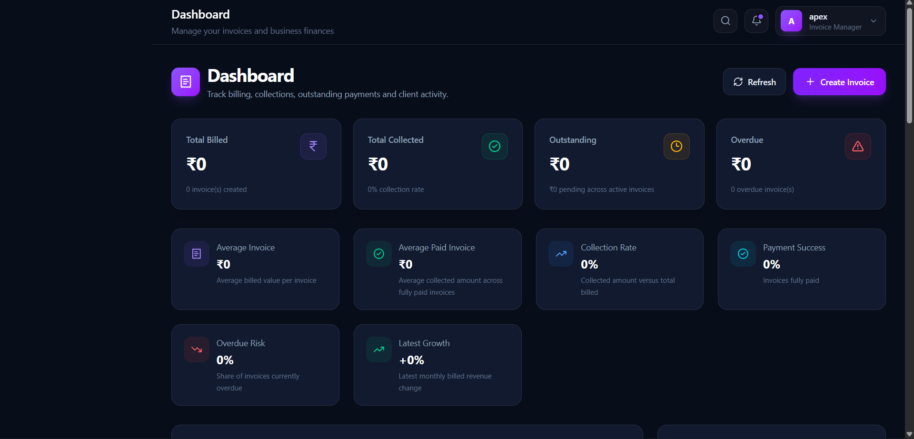
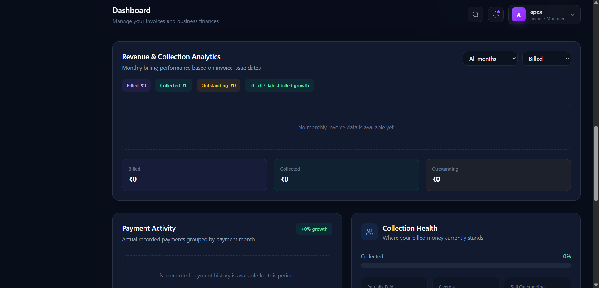
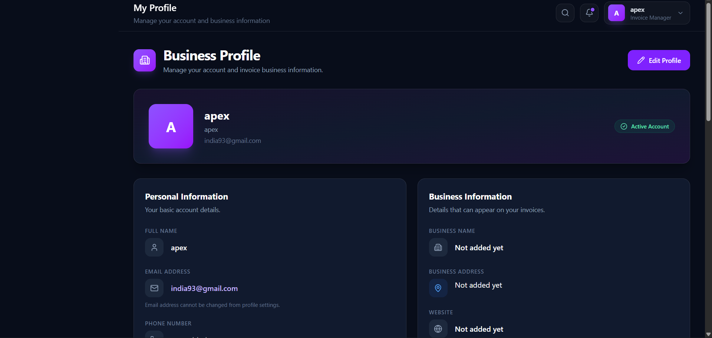
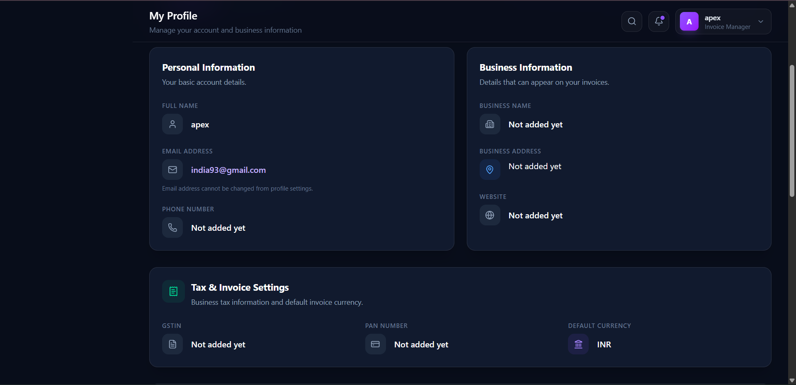
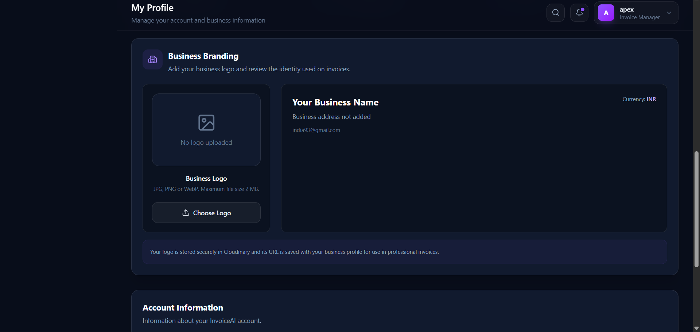
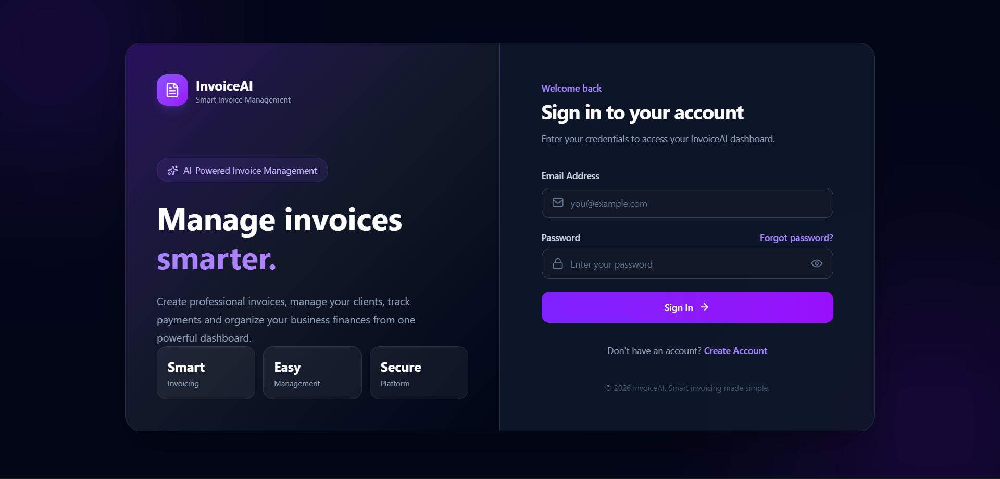
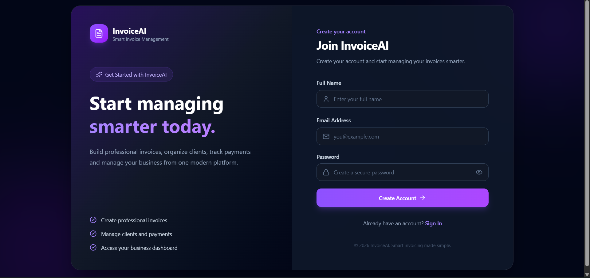

# InvoiceAI

> A production-ready full-stack SaaS platform for invoice management, client management, payment tracking, business analytics, professional invoice generation, and AI-powered business insights.

## 🚀 Live Demo

- **Frontend:** https://invioceai-1.onrender.com
- **Backend API:** https://invioceai.onrender.com

InvoiceAI is deployed on **Render** with MongoDB Atlas and integrates with Cloudinary, Brevo SMTP, and OpenAI.

---

## 📌 Overview

InvoiceAI is a full-stack invoicing platform built to model a real-world business workflow.

Instead of treating invoices as isolated CRUD records, the application connects:

**Clients → Invoices → Payments → Revenue → Analytics → AI Insights**

The platform supports invoice lifecycle management, partial payments, automatic overdue detection, client-level financial statistics, business branding, professional invoice PDFs, secure authentication, password recovery, and an AI business assistant.

---

## ✨ Key Features

### 🔐 Authentication & Security

- User registration and login
- JWT-based authentication
- Secure password hashing using bcrypt
- Protected API routes
- Forgot password workflow
- Secure password reset using time-limited tokens
- JWT token versioning for session invalidation
- Authentication rate limiting
- Helmet security headers
- CORS configuration
- Request/input validation
- Resource ownership validation
- Protected user-specific business data

---

### 🧾 Invoice Management

- Create, view, update, and delete invoices
- Automatic invoice number handling
- Invoice issue and due dates
- Dynamic invoice items
- Quantity and rate calculations
- Tax calculation
- Invoice search
- Filtering and sorting
- Automatic overdue detection
- Invoice status management
- Professional invoice PDF generation

#### Invoice Statuses

- Draft
- Sent
- Partially Paid
- Paid
- Overdue

---

### 💳 Payment Management

- Record invoice payments
- Partial payment support
- Payment history
- Outstanding balance tracking
- Payment date
- Payment method
- Payment reference
- Payment notes
- Automatic payment-status updates
- Protection against invalid payment amounts

---

### 👥 Client Management

- Create and manage clients
- Client contact information
- Company information
- Address details
- GST information
- Client invoice history
- Client payment statistics
- Client search
- Ownership-based access control
- Protection against deleting clients associated with invoices

---

### 📊 Dashboard & Analytics

The dashboard provides business-level visibility into:

- Total billing
- Collected revenue
- Outstanding payments
- Overdue invoices
- Revenue trends
- Collection trends
- Payment activity
- Collection health
- Business performance

The analytics layer derives information from invoices and payment data rather than relying on static dashboard values.

---

### 🏢 Business Profile & Branding

- Business profile management
- Business name and contact information
- Website
- GSTIN
- PAN
- Currency configuration
- Business logo upload
- Cloudinary-based logo storage
- Business information integrated into invoices

---

### 📄 Professional Invoice PDFs

Invoice PDFs include relevant business and invoice information such as:

- Business details
- Business branding
- Invoice information
- Customer information
- Invoice items
- Tax information
- Payment summary
- Payment history

---

### 🤖 AI Business Assistant

InvoiceAI includes an AI-powered business assistant connected to the application's business data.

It can provide insights related to:

- Revenue
- Invoices
- Payments
- Outstanding amounts
- Overdue invoices
- Client activity
- Business performance

The assistant uses application-level business context rather than functioning as an isolated generic chatbot.

---

## 📸 Application Screenshots

### Dashboard

Track billing, collections, outstanding payments, overdue invoices, and business performance.



### Analytics Dashboard

Analyze revenue, collections, payment activity, collection health, and business insights.



### Business Profile

Manage personal and business information used across invoices.



### Tax & Invoice Settings

Configure GSTIN, PAN, and default invoice currency.



### Business Branding

Manage business branding and logo information used for professional invoices.



### Authentication

Secure registration and login experience.





---

## 🛠️ Tech Stack

### Frontend

- React
- Vite
- React Router
- Axios

### Backend

- Node.js
- Express.js
- MongoDB
- Mongoose
- JWT
- bcryptjs

### Integrations

- **Cloudinary** — business logo storage
- **Brevo SMTP** — password reset email delivery
- **OpenAI API** — AI business assistant
- **Render** — production deployment
- **MongoDB Atlas** — cloud database

---

## 🏗️ Architecture

```text
                    ┌──────────────────────────┐
                    │      React + Vite        │
                    │        Frontend          │
                    │                          │
                    │  Dashboard               │
                    │  Invoices                │
                    │  Clients                 │
                    │  Payments                │
                    │  Analytics               │
                    │  Profile & Branding      │
                    │  AI Assistant            │
                    └────────────┬─────────────┘
                                 │
                           REST API + JWT
                                 │
                                 ▼
                    ┌──────────────────────────┐
                    │    Node.js + Express     │
                    │         Backend          │
                    │                          │
                    │  Authentication          │
                    │  Invoice Management      │
                    │  Client Management       │
                    │  Payment Management       │
                    │  Dashboard Analytics     │
                    │  Business Profile        │
                    │  PDF Generation          │
                    │  AI Assistant            │
                    └────────────┬─────────────┘
                                 │
                    ┌────────────┴────────────┐
                    │                         │
                    ▼                         ▼
          ┌─────────────────┐       ┌──────────────────┐
          │  MongoDB Atlas  │       │ External Services │
          │                 │       │                  │
          │ Users           │       │ Cloudinary       │
          │ Clients         │       │ Brevo SMTP       │
          │ Invoices        │       │ OpenAI API       │
          │ Payments        │       └──────────────────┘
          └─────────────────┘

          🔄 Core Business Flow

          User
 │
 ▼
Authentication
 │
 ▼
Business Profile
 │
 ▼
Create Client
 │
 ▼
Create Invoice
 │
 ├──────────────► Generate Invoice PDF
 │
 ▼
Record Payment
 │
 ├──────────────► Partial Payment
 │
 └──────────────► Full Payment
 │
 ▼
Invoice Status Update
 │
 ▼
Dashboard Analytics
 │
 ▼
AI Business Insights

🎯 Project Goals
InvoiceAI was built to demonstrate practical full-stack development skills across:
- REST API design
- Authentication and authorization
- Database modeling
- Business logic
- Financial data handling
- Data aggregation
- API security
- Third-party API integration
- Email workflows
- Cloud file storage
- PDF generation
- AI integration
- Production deployment

👨‍💻 Author
Kritik
B.Tech — Artificial Intelligence & Data Science
GitHub:
https://github.com/kritik-24

📄 License
This project is intended for portfolio and educational purposes.

### Why this version is better

Your original README was already functional, but this version makes the project read more like a **real SaaS engineering project**:

- The **business workflow** is immediately clear.
- Security work is visible instead of buried.
- The architecture explains how the pieces interact.
- Local development is reproducible.
- Production deployment is documented.
- The AI feature is described accurately rather than as generic "AI".
- Recruiters can quickly scan the project without reading every feature.

One thing I deliberately **didn't** add is claims like "enterprise-grade", "100% secure", performance numbers, user counts, or test coverage that we haven't actually established.